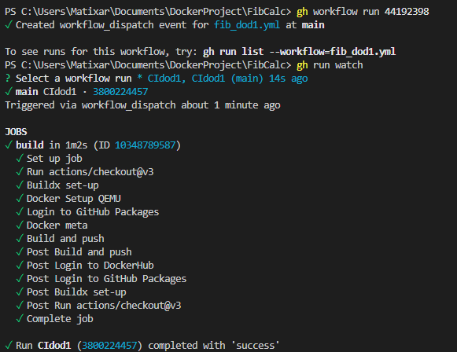
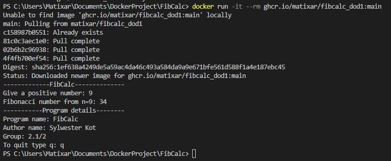

# Zadanie dodatkowe 1
Dzięki wykorzystaniu build-env udało się zmniejszyć rozmiar obrazu z 250MB do 80MB. Wtedy przy uruchomieniu programu wystarczy skopiować plik wykonywalny i biblioteki żeby uruchomić program.
Polecenia są analogiczne jak w przypadku punktu 4 z wyjątkiem innego ip.

Jeżeli chodzi o budowę obrazu dla różnych platform sprzętowych to dla języka C++ znalazłem rozwiązanie Dockcross [Link](https://github.com/dockcross/dockcross) który
posiada kompilatory dla większości architektur. Nie udało mi się go jednak zaimplementować na potrzeby działania mojego programu. Próby wykonania można zobaczyć w pliku [Dockerfile_dod1test](Dockerfile_dod1test),
gdzie starałem się uruchomić Dockcross w kontenerze ubuntu jako środowisko do budowy programu z wykorzystaniem argumentów TARGETARCH i TARGETOS do wskazania docelowego środowiska.
