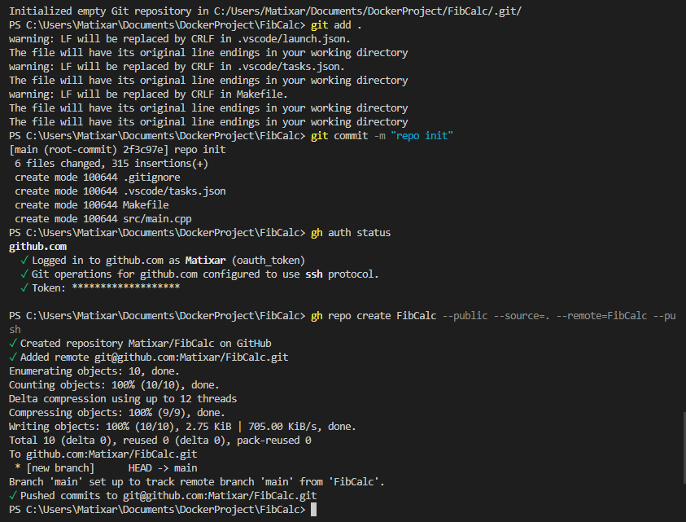

# Punkt 1
Algorytm używany do obliczania danego elementu ciągu wykorzystuje rekurencję do obliczania poszczególnych wartości:
```cpp
int fibo(int n) {
    if (n <= 1)
        return n;
    return fibo(n - 1) + fibo(n - 2);
}
```

## Polecenia wykorzystane do utworzenia repo na githubie:
- git init -b main
- git add .
- git commit -m "repo init"
- gh auth status (do sprawdzenia czy jesteśmy zalogowani do konta na github, jeżeli nie to należy użyć polecenia gh auth login)
- gh repo create FibCalc --public --source=. --remote=FibCalc --push

Wynik działania: 


